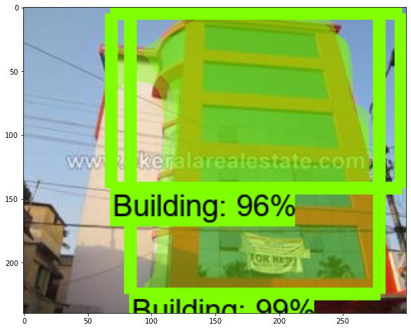

# MASK_RCNN_Object detection

Developed deep learning Mask_RCNN object detection project for masking satellite images like Buildings, Forest, and Rivers.
For this project, I took a very small image dataset like 50 images. my basic moto of this project is that the masking is done on objects or not. 
For labeling, I used the labelme tool for my image dataset. 

 

One thing to remember for labeling images in mask rcnn is deferent than other object detection like instead of box plot we used to do masking the exact object here. 

For Mask_RCNN, I took a pre-trained model like SSD_MobileNet_V1 from TFOD Zoo model. To train my model, I  used paper space for 20000 epochs it took around 3hrs to train my model.

Once 20000 epochs are done generate last(Final run) model.ckpt file to .pb file

Finally we got masking object detection images

